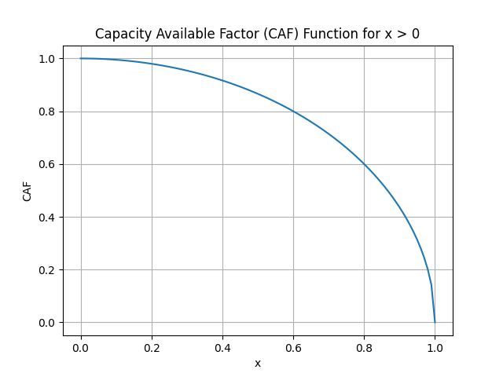
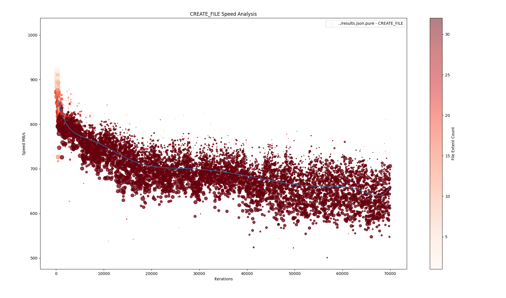

[](https://github.com/janjurca/filestorm/actions)
[](https://github.com/janjurca/filestorm/actions)
[](https://github.com/janjurca/filestorm/actions)
[](https://codecov.io/gh/janjurca/filestorm)
[](https://copr.fedorainfracloud.org/coprs/jjurca/filestorm/)
<!---
[](https://github.com/janjurca/filestorm/actions)
[](https://github.com/janjurca/filestorm/actions)
-->

# Filestorm 

**Work in progress - more features and documentation coming soon.**

## Table of Contents

- [Abstract](#abstract)
- [Other popular ways to measure filesystem performance](#other-popular-ways-to-measure-filesystem-performance)
- [Installation](#installation)
    - [Copr](#copr)
    - [From source](#from-source)
- [Usage](#usage)
    - [Basic scenario](#basic-scenario)
    - [Aging scenario](#aging-scenario)
- [Implementation](#implementation)
    - [Filesystem aging](#filesystem-aging)
    - [Aging scenario](#aging-scenario)
        - [Probabilistic state machine](#probabilistic-state-machine)
        - [File punching holes](#file-punching-holes)
- [Experiments](#experiments)
    - [Experiment 1](#experiment-1)
- [Conclusion](#conclusion)
- [Author](#author)


## Abstract
The aim of this project is to build a filesystem benchmarking tool capable of not only measure basic throughput performance of filesystem for simple rw scenarios, but mainly to provide a tool for measuring performance while the filesystem ages and gets fragmented. The ultimate goal is to provide a tool that can simulate various real-world scenarios and provide a way to measure the performance of the filesystem in those scenarios. 
The main motivation for this project is a fact that actual benchmarks only suitable for more or less artificial scenarios, and do not provide a way to measure the performance of the filesystem in more complex scenarios, like for example, when the filesystem is heavily fragmented. 

## Other popular ways to measure filesystem performance
If you are a storage QE engineer and you are looking for a way to measure filesystem performance, you probably already know about the following tools:
- **fio** - a popular tool for measuring I/O performance. It is widely used in the storage industry and provides a way to measure the performance of the storage device in various scenarios.
- **iozone** - another popular tool for measuring I/O performance. It is widely used in the storage industry and provides a way to measure the performance of the storage device in various scenarios. (Note: iozone is not actively developed anymore)
- **dd** - a simple tool for copying files. 

All of these tools are great for measuring the performance of the filesystem in various scenarios, but they lack the ability to simulate complex aging and fragmentation scenarios.

## Installation
While the project is very young it is not yet available in any standard distribution repositories. However, you can install it from external repositories or build it from source.

### [Copr](https://copr.fedorainfracloud.org/coprs/jjurca/filestorm/)
```bash
dnf copr enable jjurca/filestorm
dnf install filestorm
```

### From source

#### Fedora (or any other RPM-based distribution) dependencies
```bash
sudo dnf install -y git gcc-c++ make cmake spdlog-devel fmt-devel cxxopts-devel spdlog fmt json-devel
```
#### Ubuntu (or any other DEB-based distribution) dependencies
```bash
sudo apt install -y git g++ make cmake libspdlog-dev libfmt-dev cxxopts libjsoncpp-dev
```

#### Compile

```bash
git clone https://github.com/janjurca/Filestorm
cd Filestorm
cmake -S . -B build
cmake --build build
# Now the binary is in build/filestorm
```
#### Install
```bash
sudo cmake --install build
```

## Usage
The Filestorm features are split into several (actually two) scenarios. The first scenario **basic** is a simple rand/read/write scenario, which is mostly used to test the basic performance of Filestorm itself. But  nevertheless, it can be used to test the basic performance of the filesystem as well. But in this artificial tests is the Fio tool more suitable. The second scenario **aging** is actual core functionality of the Filestorm. It does the filesystem aging and measures the performance of the various filesystem operations. 

Filestorm is a command-line tool, hence its run is configured by command-line arguments. The basic usage is as follows:
```bash 
filestorm [general options] SCENARIO_NAME [scenario options]
```
Help can be displayed by running:
```bash
filestorm --help # for general help
```
or
```bash
filestorm SCENARIO_NAME --help # for scenario-specific help
```

### Basic scenario
Example of the basic scenario usage, which test direct io write with blocksize 4k and 1GB file size for 10 seconds:
```bash
filestorm basic -a write -b 4k -s 1G -f /tmp/file.test -t 10s
```

### Aging scenario
The core of the Filestorm can be executed as simple as follows:
```bash
filestorm aging -d /mnt/testing_dir -S 5G -s 2G -t 4h -o true
```
Command above expects that the `/mnt/testing_dir` is mounted filesystem (xfs or ext family fs) and it start to perform aging process in this directory. Please not that the directory must be empty and be aware that it is highly recommended to use a dedicated filesystem for this purpose. At this setting the maximum file size which will be created is 5GB, the minimum file size is 2GB (if there is enough space on the filesystem) the benchmarking will run for 4 hours and the output will be saved in results.json file in the current directory. Finally, the `-o true` option is to setup a direct io write.

#### Output
Output is saved in the JSON file. The output is a list of performed operations with their respective durations.
The tooling for visualisation and analysis of the output is actualy in phase of development, but you can use simple python visualisation script in `misc/process_results.py` to get some basic visualisation of the results.
The script can be called as follows:
```bash
python3 process_results.py --file ../results-1.json ../results-2.json --operations CREATE_FILE CREATE_FILE_OVERWRITE CREATE_FILE_READ     
```
Script can process multiple files at once so you can compare the results of multiple runs. The operations are the operations you want to visualize. The script will create a graph for each operation.

#### Examples of measurements


## Implementation
As you can see from the code, the implementation is done in C++. I will try to explain algorithms for the aging scenario in the following text.

Firstly we need to define what the filesystem aging is.

### Filesystem aging
Filesystem aging, in the context of fragmentation, refers to the gradual deterioration of the filesystem's performance and structure over time. This degradation occurs as files are created, modified, and deleted, leading to increased fragmentation. Fragmentation arises when the filesystem allocates storage space for files in non-contiguous chunks across the disk. As fragmentation accumulates, the efficiency of file access decreases.

This degradation can be attributed to different factors. Such as in case of HDDs, the physical limitations of the disk drive, such as the time required to move the disk head to the correct location are contributing to the performance degradation. In case of SSDs, the performance degradation is caused by increased filesystem metadata access.

Filesystem aging also refers to factors such as disk errors, metadata corruption and general wear and tear on the disk drive. While these factors are contributing to the performance degradation, they are not the focus of this project, because they are almost impossible to simulate in a controlled environment.

### Aging scenario
In the aging scenario we are aging the filesystem by performing multiple various operations on the filesystem. The whole aging process is controlled by probabilistic state machine. In which the probabilities are dynamically changing based on the current state of the filesystem free space. By this way the aging process is naturally divided into several implicit stages. At first there is created a directory structure where the files will be created. Then the highest probability is new file creation, followed by file read and file overwrite. While the filesystem is getting full, the probability of file creation is decreasing and the probability of creating free space is increasing. 

New free space is mostly created not by deleting or truncating files, but by deallocating the space of the files which are already present on the filesystem. This is done by punching holes into the files using fallocate function. This way the filesystem is getting fragmented which is the main goal of this scenario. 

#### Probabilistic state machine
The probabilistic state machine is a simple state machine where the transitions between the states are controlled by probabilities. The probabilities are dynamically changing based on the current state of the filesystem. The state machine is visualised in the following diagram:

<center>

</center>

For each transition there is defined o probability of transition. Hence the filestorm is young project, the probabilities are not yet fine-tuned and are mostly based on the intuition. The probabilities are defined in the `source/scenarios/aging.cpp` file. But one of the main precursors for every probability is so called capacity awareness factor CAF. The CAF is calculated as follows:

$$
CAF = \sqrt{1 - x^2} 
$$

$$
where:  x = \frac{usedSpace}{totalSpace}
$$

By this calculation the CAF is 1 when the filesystem is empty and 0 when the filesystem is full. And the so called awareness means that when the concern of full filesystem is not linear but is more benevolent in first let's say 70% of the filesystem capacity.
 As the following plot shows:

<center></center>


#### File punching holes
We need to fragment files effectively, so the implemented algorithm utilizes special mechanism for file hole which is visualised in the following diagram:

<center>

</center>

For every file which is managed by filestorm. We hold the fallocation count value. This value is the number of times the file was punched in a past. Then according to the fallocation count value we can calculate the size and the position of the hole which will be punched into the file. The size of the hole is calculated using file size halving algorithm.
For example when the file has not been punched yet we dived the file size by 2 then we substract the size of the blocksize * 2 which will be used for offsets and then the position of the hole is at the start of the file + offset and the size of the hole is the size of the file divided by 2 and substracted by offset.

If the file was already punched we only move the start of the hole and computing with not the whole size of file but with the size of file which remains. 

This way holes are not intersecting and the files being fragmented effectively.


## Experiments
This brief technical report would not be complete without some experiments and results. 

### Experiment 1
The first experiment was conducted on the XFS filesystem of the size 20GB. The aging process was running for 2 hours. and the command was as follows:
```bash
filestorm aging -d /mnt/testing_dir -S 5G -s 2G -t 2h -o true
```
The test was run on high-end NVMe SSD drive.

The results shows that the filesystem was heavily fragmented (Around 20 000 fragments at the end of testing) and the performance of the filesystem was visibly decreasing over time which is means that even the SSD drives are not immune to the filesystem fragmentation.

<center>
    
</center>

While the fragmentation is decreasing the performance the output of this testing is **not** a recommendation to defragment the filesystem, because it would not be clever to do on ssd drives. The main goal of this testing is to show that the filesystem fragmentation is a real thing even on SSDs and it can be simulated, measured and most importantly benchmarked by the **Filestorm** tool.


## Conclusion

The benchmarking part and comparative potential between different filesystems and filesystem versions was and is the main motivation for why this project even exists. 

The project is still in the early stages of development and there is a lot of work to be done. The main goal is to provide a tool that can simulate various real-world scenarios and provide a way to measure the performance of the filesystem in a controlled environment.


## Author
Developed by **Jan Jurca** within Kernel Performance team at Red Hat.